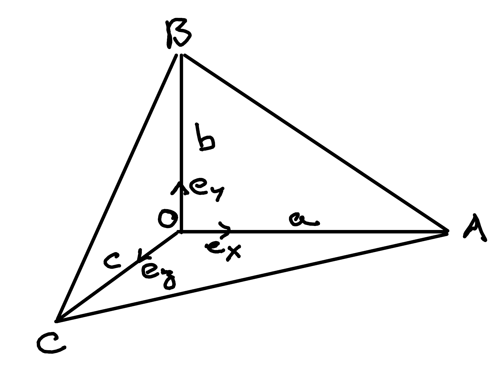

Proving De Gua's Theorem with Clifford Algebra
==============================================

.. rst-class:: custom-author

   by Stéphane Haussler

I just watched yet another `great video by Michael Penn about De Gua's theorem
<https://youtu.be/vcnQ0GR4IPI?si=Y-_ToX5qQQ7Vs4MZ>`_. Since I had never heard
of it and recently learned about Clifford Algebra as well as the Hodge dual, I
decided I would have a go at it that way. It felt a proof should work out
nicely, and it does!

If anyone is reading this, don't hesitate to `open an issue on my repository
<https://github.com/shaussler/TheoreticalUniverse/issues>`_ if something is not
as it should. You can also correct directly and I will definitely consider
merging your changes.

Taking the Clifford Product
---------------------------

Beginning with the Clifford product of :math:`\mathbf{CA}` and :math:`\mathbf{CB}`:

.. math::

   \begin{align}
   \mathbf{CA\;CB} = & (\mathbf{CO + OA}) (\mathbf{CO + OB}) \\
                   = & \mathbf{CO\;CO} + \mathbf{CO\;OB} + \mathbf{OA\;CO} + \mathbf{OA\;OB} \\
   \end{align}

Expanding both sides into dot and wedge products:

.. math::

   \begin{align}
   \mathbf{CA} \cdot \mathbf{CB} + \mathbf{CA} \wedge \mathbf{CB}
   = & \mathbf{CO} \cdot  \mathbf{CO} + \mathbf{CO} \wedge \mathbf{CO} + \\
     & \mathbf{CO} \cdot  \mathbf{OB} + \mathbf{CO} \wedge \mathbf{OB} + \\
     & \mathbf{OA} \cdot  \mathbf{CO} + \mathbf{OA} \wedge \mathbf{CO} + \\
     & \mathbf{OA} \cdot  \mathbf{OB} + \mathbf{OA} \wedge \mathbf{OB} + \\
   \end{align}

Since :math:`\mathbf{CO}` is aligned with itself, its wedge product is zero (but
not its dot product). Since we make the hypothesis of a right corner in
:math:`O`, all other dot products are zero.

.. math::

   \begin{align}
   \mathbf{CA} \cdot \mathbf{CB} + \mathbf{CA} \wedge \mathbf{CB} = & + \mathbf{CO} \cdot  \mathbf{CO} \\
                                                                    & + \mathbf{CO} \wedge \mathbf{OB} \\
                                                                    & + \mathbf{OA} \wedge \mathbf{CO} \\
                                                                    & + \mathbf{OA} \wedge \mathbf{OB} \\
   \end{align}

Identifying the Bivector Part
-----------------------------

We isolate the bivector part:

.. math::

   \mathbf{CA} \wedge \mathbf{CB} = \mathbf{CO} \wedge \mathbf{OB} + \mathbf{OA} \wedge \mathbf{CO} + \mathbf{OA} \wedge \mathbf{OB} \\

Now with reference to the picture below, we use the Area :math:`A` and basis vectors :math:`\mathbf{e_i}`

.. math::

   \mathbf{CA} \wedge \mathbf{CB} = - A_{OCB} \; \mathbf{e_z} \wedge \mathbf{e_y}
                                    - A_{OAC} \; \mathbf{e_x} \wedge \mathbf{e_z}
                                    + A_{OAB} \; \mathbf{e_x} \wedge \mathbf{e_y}

And reorder

.. math::

   \mathbf{CA} \wedge \mathbf{CB} = + A_{OCB} \; \mathbf{e_y} \wedge \mathbf{e_z}
                                    + A_{OAC} \; \mathbf{e_z} \wedge \mathbf{e_x}
                                    + A_{OAB} \; \mathbf{e_x} \wedge \mathbf{e_y}

Taking the Hodge Dual
---------------------

We take the Hodge dual of that expression:

.. math::

   \star \mathbf{CA} \wedge \mathbf{CB} = + A_{OCB} \; \star \mathbf{e_y} \wedge \mathbf{e_z}
                                          + A_{OAC} \; \star \mathbf{e_z} \wedge \mathbf{e_x}
                                          + A_{OAB} \; \star \mathbf{e_x} \wedge \mathbf{e_y}

Which results in:

.. math::

   \mathbf{CA} \times \mathbf{CB} = + A_{OCB} \; \mathbf{e_x}
                                    + A_{OAC} \; \mathbf{e_y}
                                    + A_{OAB} \; \mathbf{e_z}

Taking a unit vector :math:`\mathbf{n}` normal to the :math:`CAB` surface.

.. math::

   A_{ABC} \; \mathbf{n} = + A_{OCB} \; \mathbf{e_x}
                           + A_{OAC} \; \mathbf{e_y}
                           + A_{OAB} \; \mathbf{e_z}

Take the dot product:

.. math::

   A^{2}_{ABC} \; \mathbf{n} \cdot \mathbf{n} = + A^{2}_{OCB} \; \mathbf{e_x} \cdot \mathbf{e_x}
                                                + A^{2}_{OAC} \; \mathbf{e_y} \cdot \mathbf{e_y}
                                                + A^{2}_{OAB} \; \mathbf{e_z} \cdot \mathbf{e_z}

And we have proven:

.. math::

   A^2_{ABC} = A^2_{OCB} + A^2_{OAC} + A^2_{OAB}

Illustration
------------

