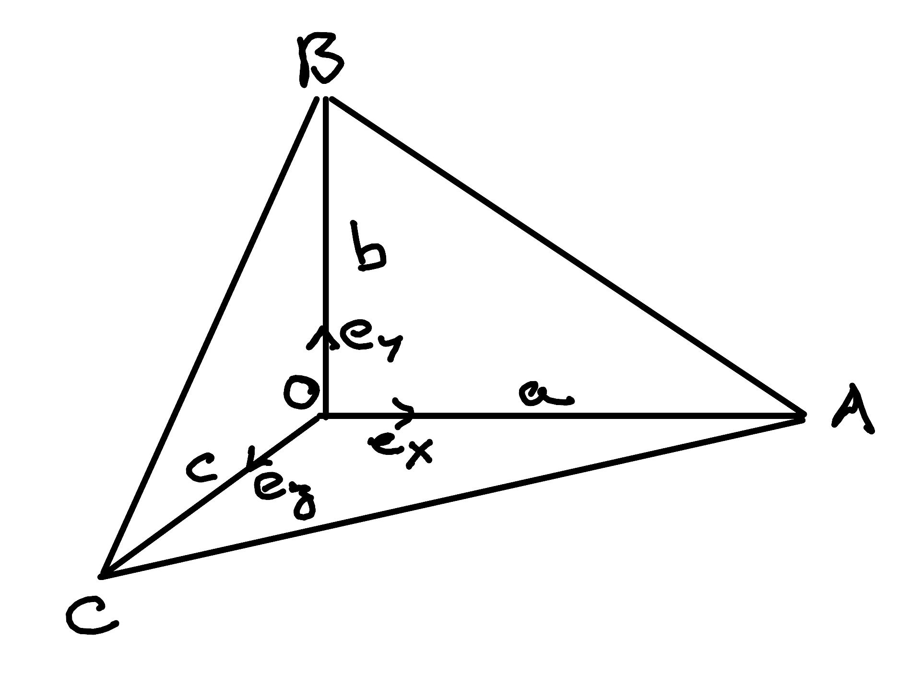

.. Theoretical Universe (c) by Stéphane Haussler

.. theoretical universe is licensed under a creative commons attribution 4.0
.. international license. you should have received a copy of the license along
.. with this work. if not, see <https://creativecommons.org/licenses/by/4.0/>.

Proving De Gua's theorem with Clifford algebra
==============================================

.. rst-class:: custom-author

   by Stéphane Haussler

I just watched yet another `great video by Michael Penn about De Gua's theorem
<https://youtu.be/vcnQ0GR4IPI?si=Y-_ToX5qQQ7Vs4MZ>`_. Since I had never heard
of it and recently learned about Clifford Algebra as well as the Hodge dual, I
decided I would have a go at it that way. It felt a proof should work out
nicely, and it does!

The theorem states that with an orthogonal corner :math:`O` and triangles
arranged as shown in the illustration, their areas follows this rule:

.. math::

   A^2_{ABC} = A^2_{OBC} + A^2_{OAC} + A^2_{OAB}

Don't hesitate to open an `issue in the Theoretical Universe repository
<https://github.com/shaussler/TheoreticalUniverse/issues>`_ if something is not
as it should. You can also correct directly and I will definitely conside
merging your changes.

Taking the Clifford Product
---------------------------

Take the Clifford product of vectors :math:`\mathbf{CA}` and
:math:`\mathbf{CB}`:

.. math::

   \mathbf{CA\;CB} &= (\mathbf{CO + OA}) (\mathbf{CO + OB}) \\
                   &= \mathbf{CO\;CO} + \mathbf{CO\;OB} + \mathbf{OA\;CO} + \mathbf{OA\;OB} \\

Expand the Cifford product on both sides into dot and wedge products:

.. math::

   \mathbf{CA} \cdot \mathbf{CB} + \mathbf{CA} \wedge \mathbf{CB}
   = & \mathbf{CO} \cdot  \mathbf{CO} + \mathbf{CO} \wedge \mathbf{CO} + \\
     & \mathbf{CO} \cdot  \mathbf{OB} + \mathbf{CO} \wedge \mathbf{OB} + \\
     & \mathbf{OA} \cdot  \mathbf{CO} + \mathbf{OA} \wedge \mathbf{CO} + \\
     & \mathbf{OA} \cdot  \mathbf{OB} + \mathbf{OA} \wedge \mathbf{OB} + \\

:math:`\mathbf{CO}` is aligned with itself and its wedge product is therefore
zero (its dot product is not zero). Since we make the hypothesis of a right
corner in :math:`O`, all other dot products are zero.

.. math::

   \mathbf{CA} \cdot \mathbf{CB} + \mathbf{CA} \wedge \mathbf{CB} =
   & + \mathbf{CO} \cdot  \mathbf{CO} \\
   & + \mathbf{CO} \wedge \mathbf{OB} \\
   & + \mathbf{OA} \wedge \mathbf{CO} \\
   & + \mathbf{OA} \wedge \mathbf{OB} \\

Identifying the Bivector Part
-----------------------------

Isolate the bivector part:

.. math::

   \mathbf{CA} \wedge \mathbf{CB} =
   \mathbf{CO} \wedge \mathbf{OB} + \mathbf{OA} \wedge \mathbf{CO} + \mathbf{OA} \wedge \mathbf{OB} \\

With reference to the illustration, we use the area :math:`A` and basis vectors
:math:`\mathbf{e}_i`:

.. math::

   \mathbf{CA} \wedge \mathbf{CB} =
   - A_{OCB} \; \mathbf{e_z} \wedge \mathbf{e_y}
   - A_{OAC} \; \mathbf{e_x} \wedge \mathbf{e_z}
   + A_{OAB} \; \mathbf{e_x} \wedge \mathbf{e_y}

Reorder:

.. math::

   \mathbf{CA} \wedge \mathbf{CB} =
   + A_{OCB} \; \mathbf{e_y} \wedge \mathbf{e_z}
   + A_{OAC} \; \mathbf{e_z} \wedge \mathbf{e_x}
   + A_{OAB} \; \mathbf{e_x} \wedge \mathbf{e_y}

Taking the Hodge Dual
---------------------

Take the Hodge dual of that last expression:

.. math::

   \star \mathbf{CA} \wedge \mathbf{CB} =
   + A_{OCB} \; \star \mathbf{e_y} \wedge \mathbf{e_z}
   + A_{OAC} \; \star \mathbf{e_z} \wedge \mathbf{e_x}
   + A_{OAB} \; \star \mathbf{e_x} \wedge \mathbf{e_y}

Which results in:

.. math::

   \mathbf{CA} \times \mathbf{CB} =
   + A_{OCB} \; \mathbf{e_x}
   + A_{OAC} \; \mathbf{e_y}
   + A_{OAB} \; \mathbf{e_z}

Consider the unit vector :math:`\mathbf{n}` normal to the :math:`ABC` surface.

.. math::

   A_{ABC} \; \mathbf{n} =
   + A_{OCB} \; \mathbf{e_x}
   + A_{OAC} \; \mathbf{e_y}
   + A_{OAB} \; \mathbf{e_z}

Taking the squared norm and obtain De Gua's theorem:

.. math::

   A^2_{ABC} = A^2_{OBC} + A^2_{OAC} + A^2_{OAB}
