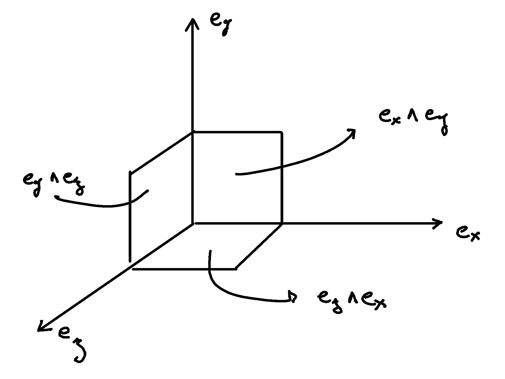

.. Theoretical Universe (c) by Stéphane Haussler

.. Theoretical Universe is licensed under a Creative Commons Attribution 4.0
.. International License. You should have received a copy of the license along
.. with this work. If not, see <https://creativecommons.org/licenses/by/4.0/>.

Basis vectors
=============

.. rst-class:: custom-author

   by Stéphane Haussler

Partial derivatives
-------------------

.. {{{

In these pages, the basis vectors :math:`\mathbf{e}_μ` are noted with the
partial derivative symbol :math:`∂_μ`:

.. math::

   \mathbf{e}_t & = ∂_t \\
   \mathbf{e}_x & = ∂_x \\
   \mathbf{e}_y & = ∂_y \\
   \mathbf{e}_z & = ∂_z \\

If you have never seen or thought of partial derivatives as basis vectors, you
may be rightfully unsettled. However this *notation* is not central to any
calculations or arguments in these pages. Therefore, I propose to *simply
accepting it*, or *just replace* the :math:`∂_μ` symbols with the
:math:`\mathbf{e}_μ` symbols. For a deeper understanding, I recommend video
`Vectors as directional derivatives
<https://youtu.be/vtPiROQUMhQ?si=_ZLQbP6nifSsGXYC>`_ by `Robert Davie
<https://www.youtube.com/@TensorCalculusRobertDavie>`_, and video `Manifolds 22
| Coordinate Basis
<https://www.youtube.com/watch?v=BjU8-n4ixqo&list=PLHlTqVYmqunWXBoO3xZhQOAoc8oqd-2Su&index=48>`_
by `The Bright Side of Mathematics
<https://www.youtube.com/@brightsideofmaths>`_.

As very broad justification and without systematically laying down the
properties of a vector space, notice how partial derivatives indeed fulfill the
definition for a `vector space
<https://en.m.wikipedia.org/wiki/Vector_space>`_. They behave linearly like
vectors and the following examplary relations hold:

.. math::

  a (∂_t + ∂_x) = a ∂_t + a ∂_x \\
  (a+b) ∂_y     = a ∂_y + b ∂_y \\

.. }}}

Differentials
-------------

.. {{{

Using the partial derivatives as basis vectors :math:`\mathbf{e}_μ`, the
associated covectors :math:`\mathbf{e}^ν` are the differential operators:

.. math::

   \mathbf{e}^t & = dt \\
   \mathbf{e}^x & = dx \\
   \mathbf{e}^y & = dy \\
   \mathbf{e}^z & = dz \\

With :math:`δ` being the Kronecher-delta, the differential operators
:math:`dx^ν` fullfill the definition for covectors, i.e. :math:`\mathbf{e}^μ
\mathbf{e}_ν = δ^μ_ν`. We have:

.. math::

   dx^μ ∂_ν = δ^μ_ν

.. _orientation_of_space:

.. }}}

Orientation of space
--------------------

.. {{{

   Basis directions and surfaces

We order vectors and bivectors by the letters :math:`x`, :math:`y`, and
:math:`z`. Cycling directions counterclockwise, we can go from:

* :math:`x` to :math:`y` to :math:`z`, or
* :math:`y` to :math:`z` to :math:`x`, or
* :math:`z` to :math:`x` to :math:`y`

=========== ================= =============
Direction   Surface           Permutation
=========== ================= =============
:math:`∂_x` :math:`∂_y ∧ ∂_z` :math:`x,y,z`
:math:`∂_y` :math:`∂_z ∧ ∂_x` :math:`y,z,x`
:math:`∂_z` :math:`∂_x ∧ ∂_z` :math:`z,x,y`
=========== ================= =============

Traversing the table above from left to right or top to bottom, we cycle
exactly through the permutations of the spatial directions. I personally had
difficulties with respect to :math:`∂_z ∧ ∂_x`. For a long time, as my natural
inclination was to always order the elements of the basis surfaces
alphabetically and thus take :math:`∂_x ∧ ∂_z`, which result in a negative sign
when flipping the surface :math:`-∂_z ∧ ∂_x`. Taking :math:`∂_z ∧ ∂_x` is the
superior choice.

.. }}}

The Equal Things
----------------

.. {{{

Directions, vectors, and dual covectors are representation of the same thing.

Sufaces, bivectors, and the dual or mixed tensor are representations of the
same object. Rotation matrices with :math:`A=A^T` are the same object as mixed
tensors and without explicit basis.

.. }}}
