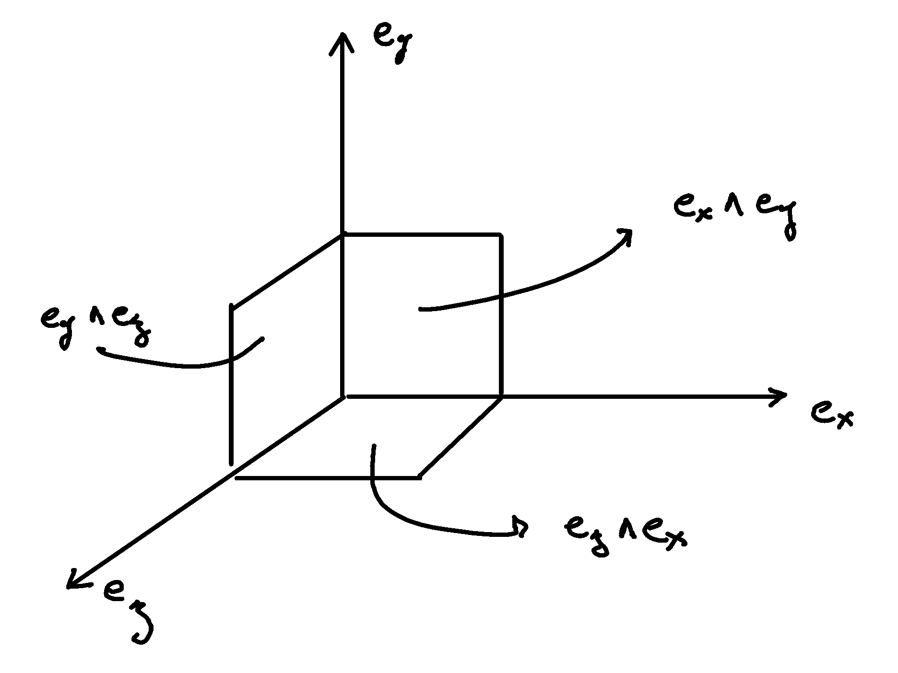

.. _hodge_duality:

Hodge duality
=============

.. rst-class:: custom-author

   by Stéphane Haussler

The Hodge dual is often presented in a needlessly complex manner, taking into
account from the get go a number of dimensions above three, and any metric
signatures. The concept is natural with the three dimensions we are accustomed
to live in. Extending the idea then to 4-dimensional Minkowski space may feel
quite easier. In this article, I tentatively simplify the concept of the Hodge
dual by first limiting the discussion to three dimensions, making it more
accessible.

I assume the reader possesses a strong grasp of vector calculus and a working
understanding of *differential forms* and the *wedge product* :math:`∧`.

Duality in three dimensions
---------------------------

First consider a coordinate basis in 3 dimensions corresponding to our
intuitive understanding of space :math:`∂_x`, :math:`∂_y` and :math:`∂_z`.
Observe that we did not merely define three unit vectors, but also three *unit
surfaces* that we name using the wedge symbol :math:`∧`. The surface along the
:math:`x` and :math:`y` axis is named :math:`∂_x ∧ ∂_y`, along the :math:`y`
and :math:`z` axis :math:`∂_y ∧ ∂_z`, and along the :math:`z` and :math:`x`
axis, :math:`∂_z ∧ ∂_x`:

The naming of the surfaces is carefully chosen counterclock wise. The reason is
that not only we can define a surface (a number) from two vectors but also
given a vector together with a surface, we can uniquely determine the second
vector needed to obtain that surface. The surface need be oriented and a sign
convention chosen (counterclockwise is positive). For example, :math:`∂_z ∧ ∂_x
= - ∂_x ∧ ∂_z`.

Each basis surface can be associated with a unique basis vector:

.. math::

   ∂_x ∧ ∂_y \rightarrow ∂_z \\
   ∂_y ∧ ∂_z \rightarrow ∂_x \\
   ∂_z ∧ ∂_x \rightarrow ∂_y

We note this relation with the star symbol :math:`⋆`:

.. math::

   ⋆ ∂_x ∧ ∂_y = ∂_z \\
   ⋆ ∂_y ∧ ∂_z = ∂_x \\
   ⋆ ∂_z ∧ ∂_x = ∂_y

This association defines a dual vector to every oriented surfaces and is called
the Hodge dual, noted with the star operator :math:`⋆` operator. The relation
holds in both direction:

.. math::

   ⋆ ∂_z = ∂_x ∧ ∂_y \\
   ⋆ ∂_x = ∂_y ∧ ∂_z \\
   ⋆ ∂_y = ∂_z ∧ ∂_x

The Hodge dual in three dimensions is the cross product. The cross product
defines a vector perpendicular to the surface whose length is proportional to
the amount of rotation:

.. math::

   ∂_x ⨯ ∂_y = ⋆ ∂_x ∧ ∂_y = ∂_z \\
   ∂_y ⨯ ∂_z = ⋆ ∂_y ∧ ∂_z = ∂_x \\
   ∂_z ⨯ ∂_x = ⋆ ∂_z ∧ ∂_x = ∂_y

This establishes the deep connection between the Hodge dual, rotations,
surfaces, and the cross product.

Going one step futher, we observe that we did not merely define unit surfaces,
but also unit volumes that we note :math:`∂_x ∧ ∂_y ∧ ∂_z`. We can associate
the unit volume with numbers:

.. math::

   ⋆ \mathbf{1} = ∂_x ∧ ∂_y ∧ ∂_z

As well as:

.. math::

   ⋆ ∂_x ∧ ∂_y ∧ ∂_z = \mathbf{1}

Where :math:`\mathbf{1}` is the unit number. In other words any number can be
expressed as a linear combination of :math:`1`.

.. _pseudo_vectors_and_pseudo_scalars:

Pseudo vectors and pseudo scalars
---------------------------------

For the vector basis the following objects are defined:

* Scalars.
* Vectors.
* Bivectors correspoding to surfaces and often called pseudo-vectors.
* Trivectors corresponding to volumes and often called pseudo-scalars.

Placing the objects in front of a mirror:

* Scalars look the same.
* Vectors look the same.
* Surfaces are flipped and the sign changes.
* Volumes are flipped and the sign changes.

This is the reason behind the naming *pseudo-vector*. When placed in front of a
mirror, the sign of a positive oriented surface goes to negative. These objects
are associated to vectors through the hodge dual. These dual vectors flip their
directions with the image of the oriented surface.

This is also the reason behind the name *pseudo-scalar*. When placed in front
of a mirror, the sign of a positive oriented volume goes to negative. These
objects are associated to scalars through the hodge dual. This dual scalars
flip their signs with the image of the oriented volume.

.. _duality_in_minkowski_space:

Duality in Minkowski space
--------------------------

.. warning::

   Under construction

.. math::
   :nowrap:

   \begin{alignat*}{2}
   ⋆ (∂_t ∧ ∂_x) &= - &∂_y ∧ ∂_z \\
   ⋆ (∂_t ∧ ∂_y) &= - &∂_z ∧ ∂_x \\
   ⋆ (∂_t ∧ ∂_z) &= - &∂_x ∧ ∂_y \\
   ⋆ (∂_x ∧ ∂_y) &=   &∂_t ∧ ∂_z \\
   ⋆ (∂_y ∧ ∂_z) &=   &∂_t ∧ ∂_x \\
   ⋆ (∂_z ∧ ∂_x) &=   &∂_t ∧ ∂_y \\
   \end{alignat*}

.. math::

   ⋆ dt = - dx ∧ dy ∧ dz \\
   ⋆ dx = - dt ∧ dy ∧ dz \\
   ⋆ dy = - dt ∧ dz ∧ dx \\
   ⋆ dz = - dt ∧ dx ∧ dy

.. math::
   :nowrap:

   \begin{equation}
   \newcommand{\+}{\phantom{+}}
   \begin{matrix}
   ⋆ (dt ∧ dx) &=  - dy ∧ dz \\
   ⋆ (dt ∧ dy) &=  - dz ∧ dx \\
   ⋆ (dt ∧ dz) &=  - dx ∧ dy \\
   ⋆ (dy ∧ dz) &= \+ dt ∧ dx \\
   ⋆ (dz ∧ dx) &= \+ dt ∧ dy \\
   ⋆ (dx ∧ dy) &= \+ dt ∧ dz \\
   \end{matrix}
   \end{equation}
